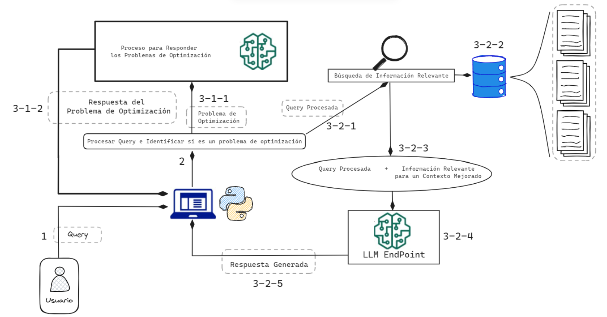
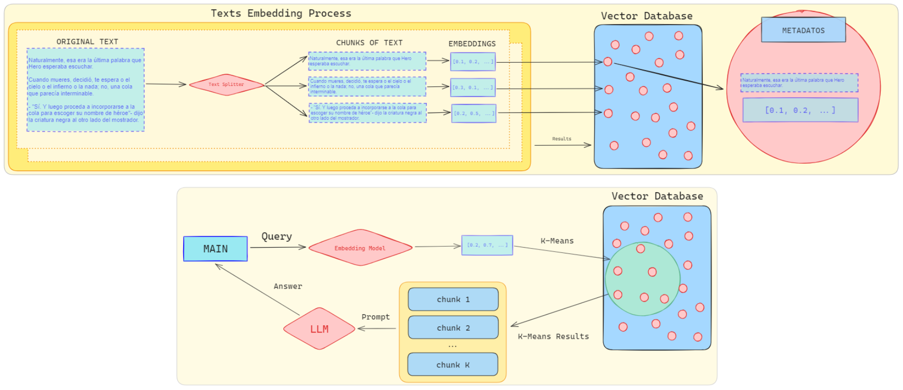
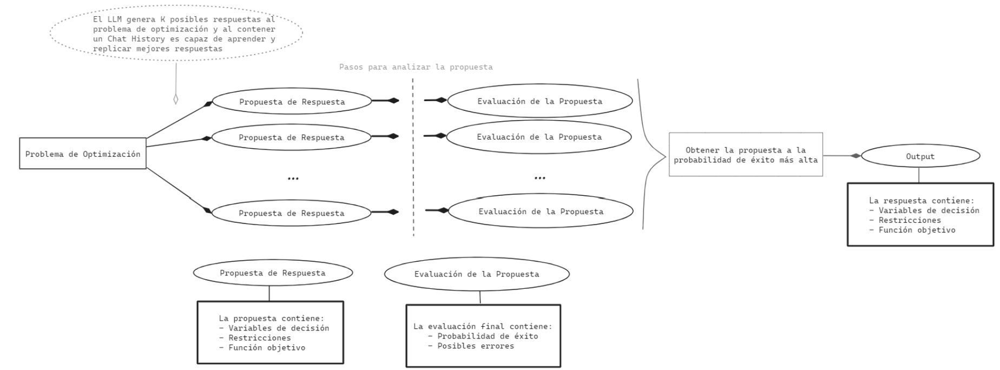
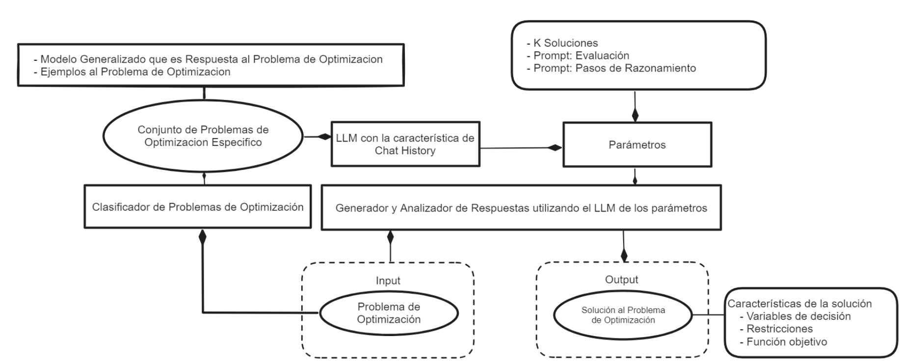

# Service-Bot 

## Descripción del Proyecto. Objetivos y Limitaciones

Un modelo de optimización matemática es una herramienta fundamental en la toma de decisiones, compuesta por una función objetivo y un conjunto de restricciones en forma de sistemas de ecuaciones o inecuaciones. 

Este proyecto combina la potencia de los LLMs con la capacidad de análisis de documentos para crear un sistema que da respuestas a problemas de optimización matemática. Este sistema tiene las siguientes características:

1. *Análisis automático de problemas de optimización:* Capacidad de identificar el tipo de problema de optimización al analizar las entradas del usuario y posibilidad de analizar información proporcionada por el usuario, como tablas, para determinar si corresponde a un problema de optimización matemática  
2. *Generación de soluciones óptimas:* Uso de LLMs para analizar grandes cantidades de información y generar soluciones óptimas para problemas de optimización complejos
3. *Análisis de documentos:* Capacidad de analizar documentos relevantes para proporcionar contexto adicional a la respuesta que proporcione al usuario 
4. *Uso de técnicas de Ingeniería de Prompt:* Aplicación de ToT (Tree-of-Thought) y CoT (Chain-of-Thought) para mejorar la precisión de las respuestas 

Este sistema enfrenta algunas limitaciones importantes:

1. *Precisión potencialmente baja:* La respuesta proporcionada por el sistema no garantiza siempre la correctitud matemática
2. *Complejidad temporal:* El uso de técnicas de Ingeniería de Prompt, junto con cada llamada al LLM, puede aumentar significativamente el tiempo necesario para procesar y responder a las consultas

## Instalación del Proyecto

1. Obtener una `google_api_key` que proporciona Google de forma gratuita en https://aistudio.google.com
2. Instalar las dependencias del proyecto
3. Luego ejecutarlo con `streamlit run deploy_streamlit.py`

## Diseño del Proyecto

Este sería un diseño de cómo funciona el proyecto:

### RAG

RAG es un enfoque que mejora la capacidad de los LLMs para generar respuestas más precisas y relevantes al integrar información de una base de conocimientos externa durante el proceso de generación de texto. Este método permite referenciar y utilizar información que no estaba presente en los datos de entrenamiento original, lo que resulta en respuestas más contextualizadas y precisas en diversas tareas 

Nuestro sistema utiliza este enfoque y está compuesto por dos componentes principales: 

1. *Recuperación de información:* busca en una base de datos vectorial para encontrar contenidos relevantes que respondan a la consulta del usuario. 
2. *Generación de respuestas:* utiliza un LLM que integra la información recuperada para sintetizar una respuesta coherente y útil al usuario

### Chat History y Técnicas de Ingeniería de Prompts

Chat History establece el marco para que el LLM comprenda el formato esperado de la pregunta y la respuesta.

A continuación se muestra una idea del diseño interno para generar y analizar las propuestas que genera el LLM usando una combinación te técnicas de ingeniería de prompts 

La siguiente imagen es la idea del diseño externo del analizador y generador de propuestas para los problemas de optimización. En esta se puede ver que antes de pasar a analizar el problema de optimización, primero se clasifica el problema de optimización, en alguno que ya este definido anteriormente. Este clasificador es un LLM sin la característica de Chat History y toma todos los modelos de diferentes problemas de optimización y retorna el modelo que más puede acercarse a ser una respuesta del problema de optimización inicial.

