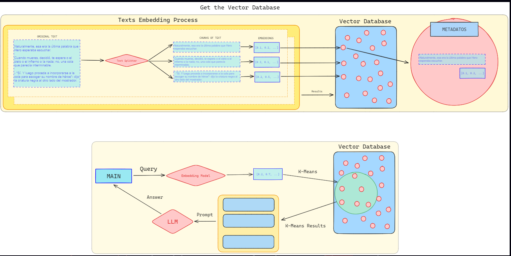

# Descripción del proyecto

# Pasos para desplegar 

1. Instalar los módulos de: `requirements.txt`
2. Crear un nuevo bot con el bot de Telegram [BotFather]
3. Copiar el nombre del bot y el token que te genera en un archivo `.env`

